Please include your answers to the questions below with your submission, entering into the space below each question
See [Mastering Markdown](https://guides.github.com/features/mastering-markdown/) for github markdown formatting if desired.

**Note: All current measurements shall be taken at a 2.25 second period with an LED on-time of 175ms. All average currents should be taken at a time scale of 200mS/div. See the pop-up menu in the lower-right corner of the Energy Profiler window**

**1. Fill in the below chart based on currents measured in each energy mode, replacing each TBD with measured values.  Use the [Selecting Ranges](https://www.silabs.com/documents/public/user-guides/ug343-multinode-energy-profiler.pdf) feature of the profiler to select the appropriate measurement range.  Your measurements should be accurate to 10%**

Energy Mode | Period (ms) | LED On Time (ms) |Period average current (uA) | Average Current with LED off (uA) | Average Current with LED On (uA)
------------| ------------|------------------|----------------------------|-----------------------------------|---------------------------------
EM0         |    2250     |       175        |         5430               |           5390                    |         5870
EM1         |    2250     |       175        |          3720              |           3680                    |         4150
EM2         |    2250     |       175        |          44.48             |           4.02                    |         503.39 
EM3         |    2250     |       176        |          43.48             |           4.43                    |         505.95

**2. ScreenShots**  

***EM0***  
Period average current    
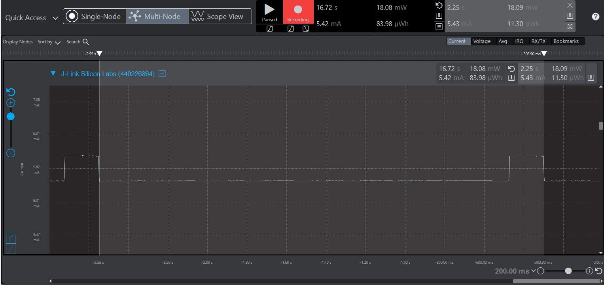 
Average Current with LED ***off***  
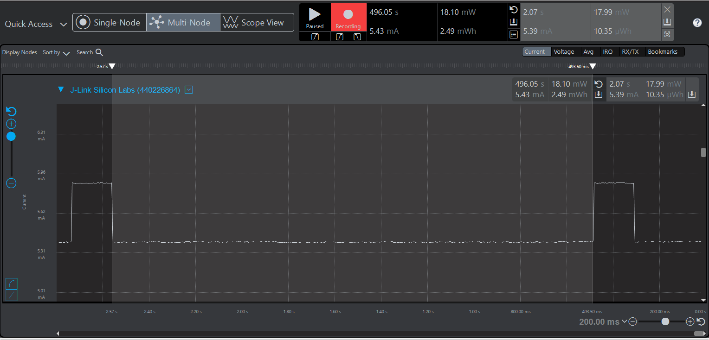  
Average Current with LED ***on***  
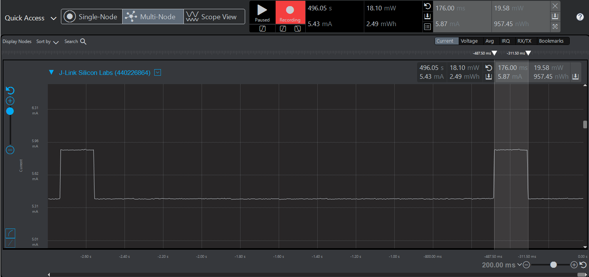 

***EM1***  
Period average current    
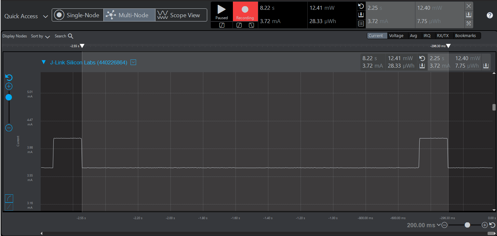  
Average Current with LED ***off***  
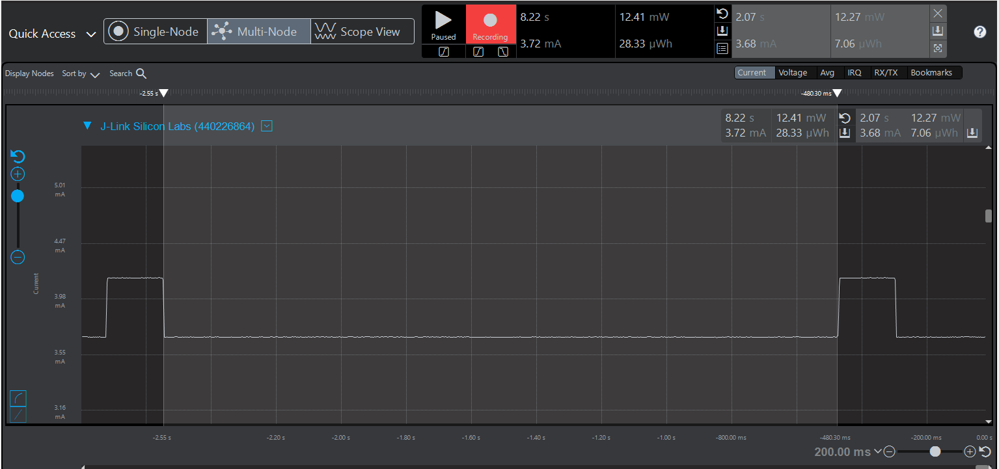 
Average Current with LED ***on***  
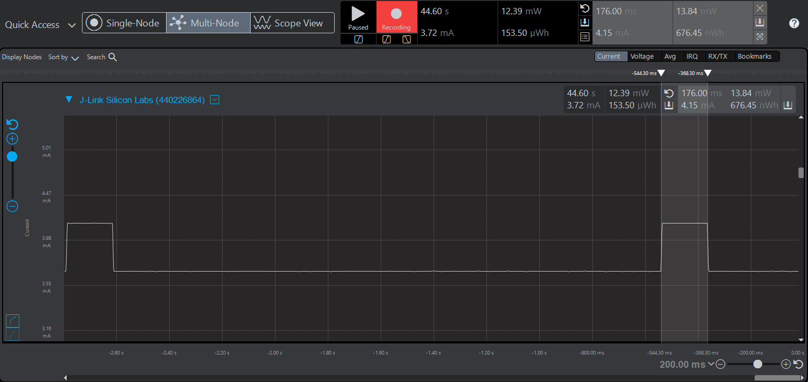  

***EM2***  
Period average current  
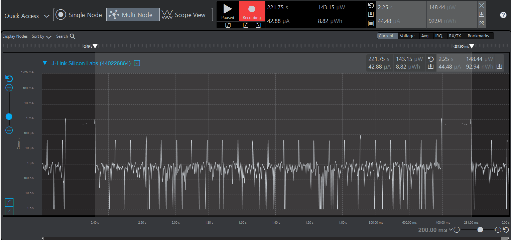  
Average Current with LED ***off***  
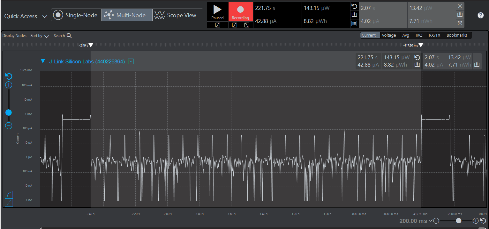  
Average Current with LED ***on***  
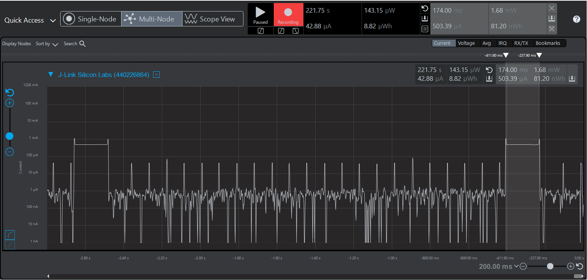   
LED measurement - Period   
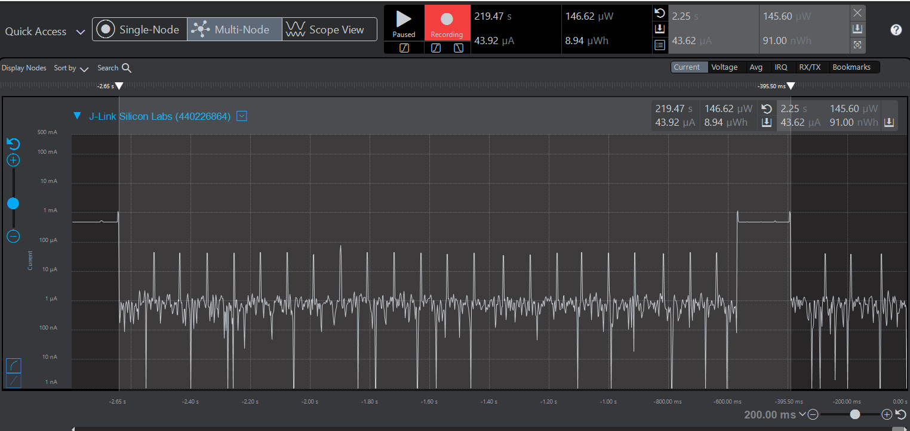 
LED measurement - LED on time   
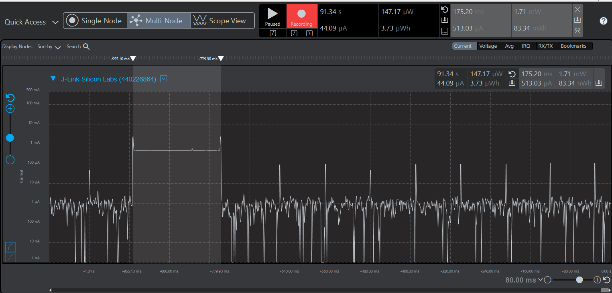  

***EM3***  
Period average current    
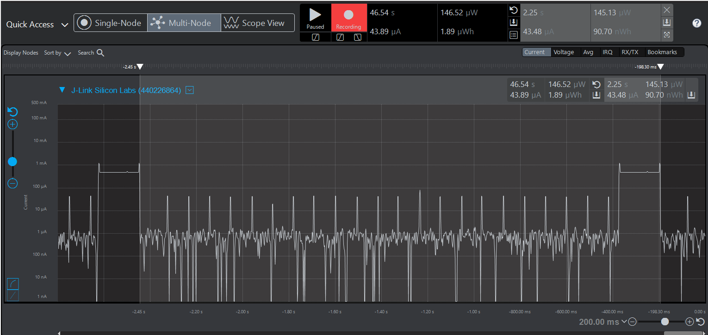  
Average Current with LED ***off***  
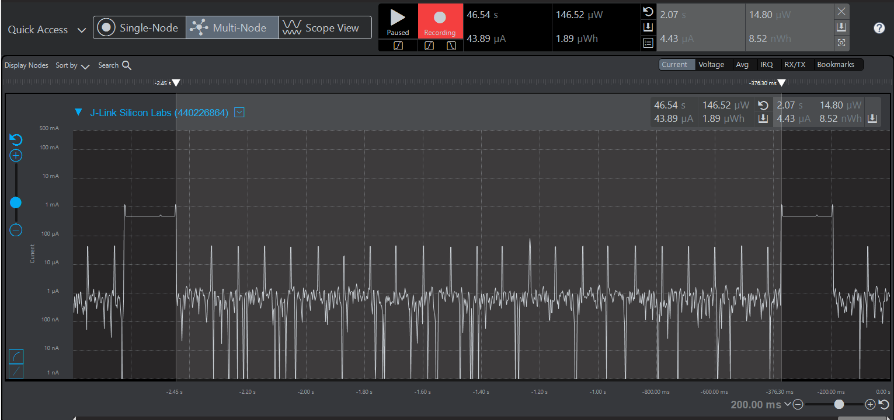   
Average Current with LED ***on***  
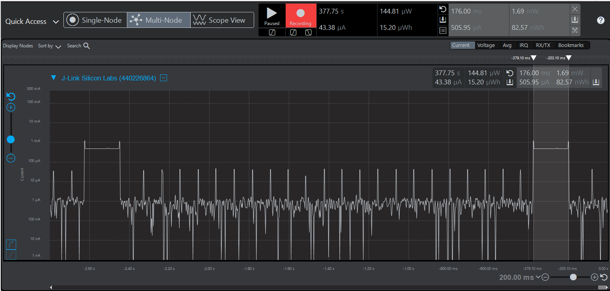  
LED measurement - Period   
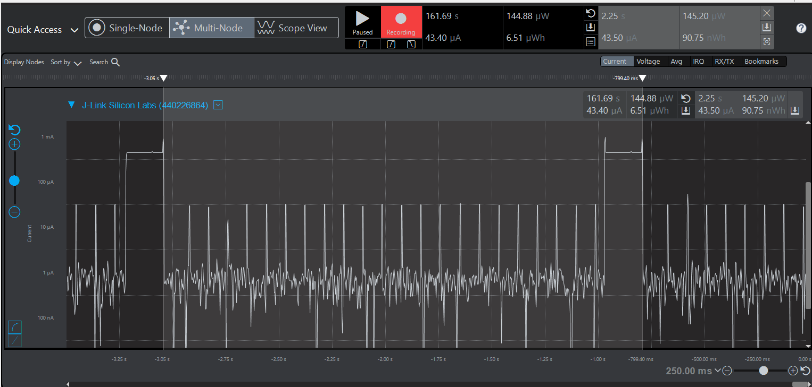  
LED measurement - LED on time   
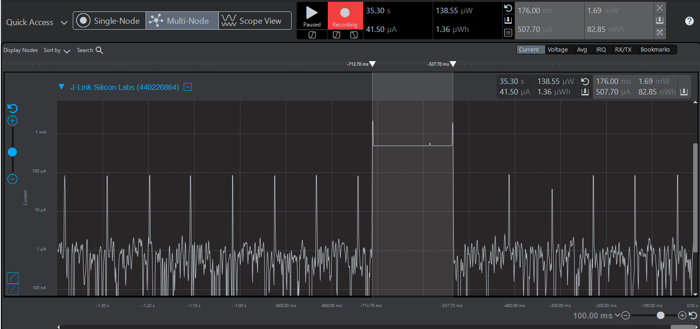  

