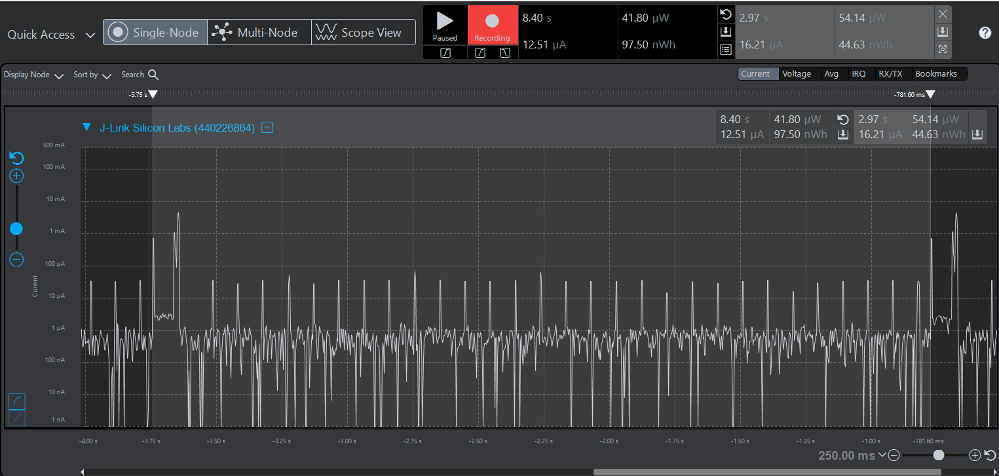
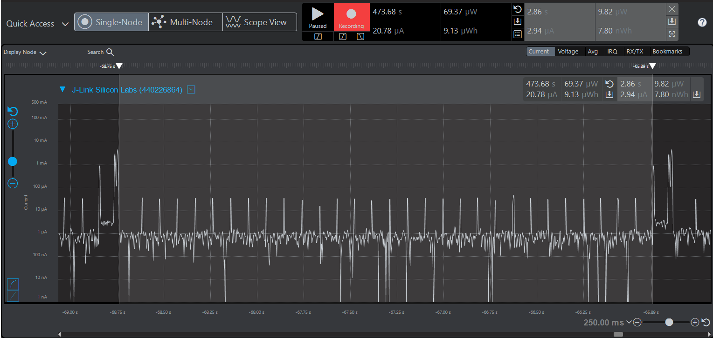
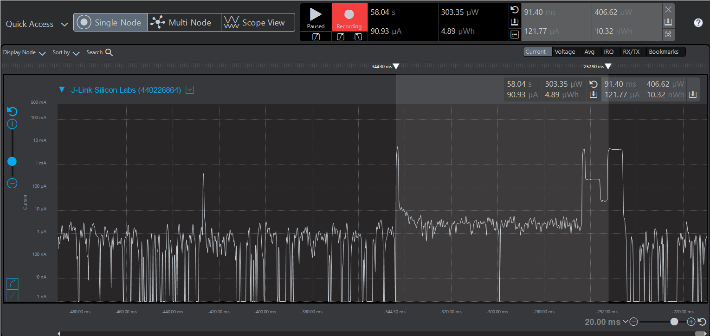
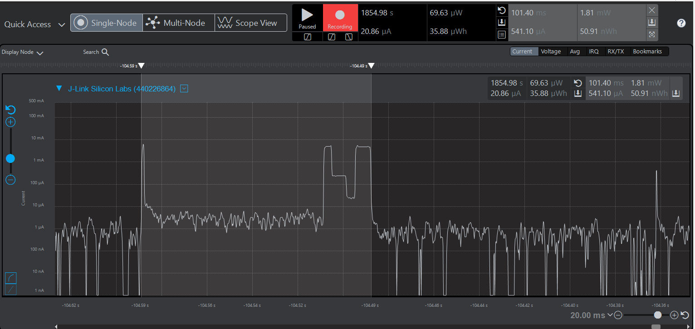

Please include your answers to the questions below with your submission, entering into the space below each question
See [Mastering Markdown](https://guides.github.com/features/mastering-markdown/) for github markdown formatting if desired.

*Be sure to take measurements with logging disabled to ensure your logging logic is not impacting current/time measurements.*

*Please include screenshots of the profiler window detailing each current measurement captured.  See the file Instructions to add screenshots in assignment.docx in the ECEN 5823 Student Public Folder.* 

1. What is the average current per period? (Remember, once you have measured your average current, average current is average current over all time. Average current doesn’t carry with it the units of the timespan over which it was measured).
   Answer:16.21uA
    Screenshot:  
     

2. What is the ave current from the time we sleep the MCU to EM3 until we power-on the 7021 in response to the LETIMER0 UF IRQ?
   Answer:2.33uA
    Screenshot:  
     

3. What is the ave current from the time we power-on the 7021 until we get the COMP1 IRQ indicating that the 7021's maximum time for conversion (measurement) has expired.
   Answer:115.82uA
    Screenshot:  
     

4. How long is the Si7021 Powered On for 1 temperature reading?
   Answer:98.9ms
    Screenshot:  
     

5. Given the average current per period from Q1, calculate the operating time of the system for a 1000mAh battery? - ignoring battery manufacturers, efficiencies and battery derating - just a first-order calculation.
   Answer (in hours):
   Average current = 16.21uA = 0.01621 mA
   Battery capacity = 1000mA per hour
   operating time = battery capacity/average current =1000mAh/0.02029mA =61,690 hours
   
6. How has the power consumption performance of your design changed since the previous assignment?
   Answer:
 |--------------------------------------------------------------------------------------------------|
 |   AVERAGE CURRENT             |  BLOCKING CALL -assignment 3 |  NON-BLOCKING CALLS -assignment 4 |
 |--------------------------------------------------------------------------------------------------|
 | Per period                    |         155.17uA             |            16.21uA                |
 | During sleep until power-on   |         7.59uA               |            2.33uA                 |
 |From power-on till wait expires|         4.87mA               |            115.82uA               |
 |operating time for 1000mAh Bt  |         6,445hrs             |            61,690hrs              |
 |--------------------------------------------------------------------------------------------------|                                                              
   From the above table, it is evident that the average currents is less in assignment-4 than in the previous assignment.
   Thus the power consumption when using  non-blocking calls(interrupt based waits and i2c transfers) in assignment-4 is less compared to the blocking calls(polling based waits and i2c transfers) in assignmnet-3. 
   Performing the I2C transfers  and sleeping in EM1 ; and also sleeping in EM3 during the wait periods has effectively influenced the power consumption. 
   The operating time for the 1000mAh battery capacity is more when the average current is measured with non-blocking calls.

